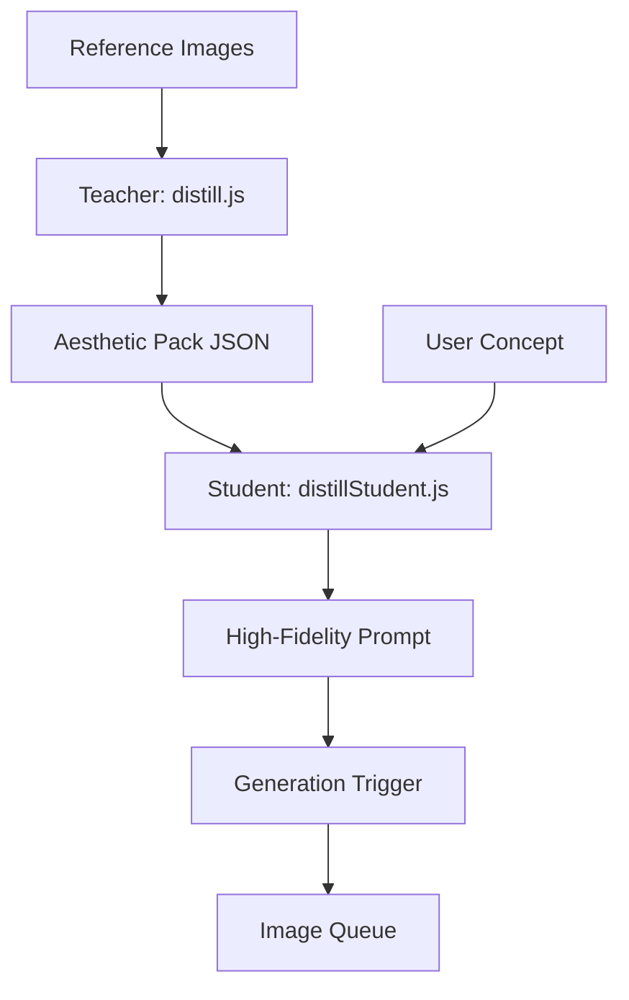

# Distill Pipeline: Overview

The Distill Pipeline is a two-stage generative system designed to capture, formalize, and re-apply visual aesthetics using AI. It separates the "observation" of style from the "creative act" of generation.

## Modes of Operation

### 1. Simple Distillation
A single pass analyzing a small batch of images (3-10). Ideal for quick captures of distinct styles.

### 2. Sequenced Distillation (Iterative Refinement)
A multi-pass process that scales to hundreds of images.
- **Logic**: Images are processed in chunks. An initial pack is created, then refined by subsequent chunks.
- **Resiliency**: The system automatically skips chunks that trigger safety filters, ensuring the distillation process continues.
- **Fidelity**: This mode produces significantly higher confidence scores and more robust style locking by aggregating evidence over a larger sample size.

2.  **Stage 2: The Student (Prompt Composition)**
    - **Handler**: `handleStudentComposeRequest` ([distillStudent.js](file:///Users/bozoegg/Desktop/DreamBeesv11/functions/handlers/distillStudent.js))
    - **Input**: An Aesthetic Pack + (optional) User Request.
    - **Logic**: Translates abstract pack rules into high-fidelity image prompts using internal modes (Stabilized, Variant, Strain, Edge).
    - **Output**: A single high-fidelity prompt and negative prompt.

3.  **Stage 3: Automated Trigger (Image Generation)**
    - **Logic**: The Student automatically calls the `Generation` handler.
    - **Output**: An enqueued image generation task in the system queue.

## Data Flow

## Key Files
- [distill.md](file:///Users/bozoegg/Desktop/DreamBeesv11/distill.md): System prompt for the Teacher.
- [distill-student.md](file:///Users/bozoegg/Desktop/DreamBeesv11/distill-student.md): System prompt for the Student.
- [functions/packs/](file:///Users/bozoegg/Desktop/DreamBeesv11/functions/packs/): Local storage for generated packs.
